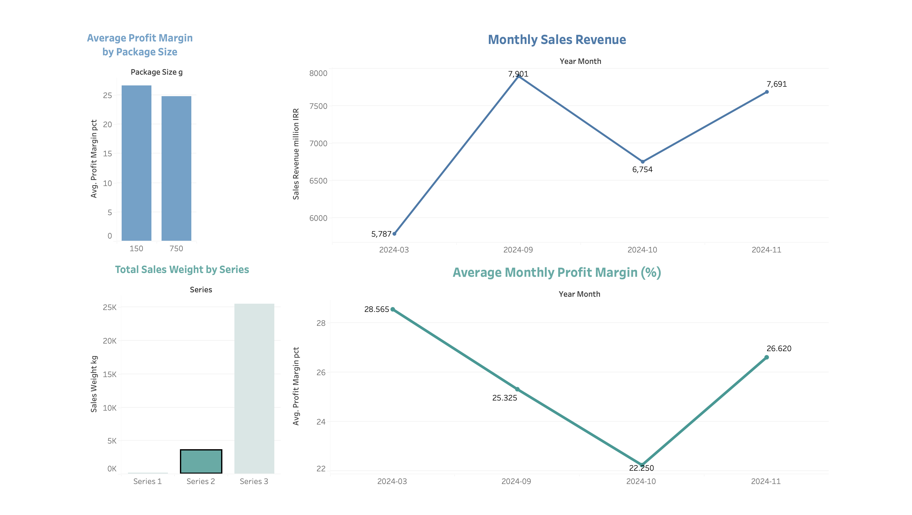

# coffee-sales-dashboard
Sales analysis dashboard for a coffee company, built with Tableau. Includes simulated data for confidentiality.

## Introduction
This report is based on sales data from a coffee company.  
The goal of this analysis is to evaluate the performance of three coffee series over time and extract insights to support better business decisions.  

To protect company confidentiality, **all numerical values and figures in this report are simulated and differ from the real data**. However, the structure of the data and the analysis reflect realistic business conditions.  

---

## Product Series

- **Series 3**  
  - Economical, lower price range  
  - Highly popular among home consumers and cafés  
  - Highest sales volume and revenue share  
  - Available in 150g, 750g, and 4000g packages  

- **Series 2**  
  - More specialized coffees with higher prices  
  - Suitable for pour-over and specialty espresso  
  - Lower production volume compared to Series 3  
  - Available in 150g and 750g packages  

- **Series 1**  
  - High-end coffees (+90 scoring), premium pricing  
  - Produced and sold in very limited volumes  
  - Available in 80g packages only  
  - Targeted at coffee enthusiasts and specialty cafés  

---

## Dashboard Preview

Here are some screenshots of the Tableau dashboard (for users who may not have Tableau installed):

### Overall Dashboard
Includes:
- Average profit margin by package size  
- Monthly sales revenue  
- Total sales weight by series  
- Average monthly profit margin  

  

---

### Series 3 Dashboard
Focused analysis on Series 3 (economical, high-volume products).  

  

---

### Series 2 Dashboard
Focused analysis on Series 2 (specialty coffees with higher pricing).  

  

---

### Series 1 Dashboard
Focused analysis on Series 1 (premium, limited-volume coffees).  

  

---

## Dashboard Insights

1. **Monthly Sales Revenue**  
   - Series 3 consistently contributed the largest share of revenue.  
   - Sales dips in Series 1 and 2 were mainly caused by **stock-outs and delayed replenishment**, not reduced demand.  

2. **Average Profit Margin by Package Size**  
   - Smaller packages (80g, 150g) generally yielded higher profit margins.  
   - Larger packages (4000g) had thinner margins but were important for bulk buyers and market share.  

3. **Sales Weight by Series**  
   - Series 3 accounted for the largest sales volume.  
   - Series 2 contributed less in volume but remained significant in revenue due to higher pricing.  
   - Series 1 represented a very small share in weight but a high unit value.  

---

## Key Insights

- **Series 3** is the backbone of sales and should remain the primary focus for marketing and distribution.  
- **Series 2** plays an essential role in profitability despite lower volumes; ensuring stock availability is critical.  
- **Series 1** enhances the company’s brand image and presence in the premium market segment.  
- Sales declines in certain months were directly tied to **inventory shortages** rather than falling customer demand.  

---

## Tools & Skills Used

- **Tableau** → Data visualization, dashboard design, interactive charts  
- **Data Preparation (CSV)** → Cleaning and structuring data for analysis  
- **Sales Analysis** → Identifying trends, profit margin insights, product mix evaluation  
- **Business Understanding** → Translating raw sales data into actionable insights  

---

## Conclusion

The analysis highlights how the three coffee series collectively balance **volume, profitability, and brand positioning**.  
- Pricing and inventory strategies should be tailored for each series.  
- Improved stock management, especially for Series 1 and 2, is critical to prevent lost sales opportunities. 

---

📌 *Disclaimer*: All numerical values in this report are **simulated** and do not represent the company’s real figures. This ensures the confidentiality of business information while preserving analytical insights.  
